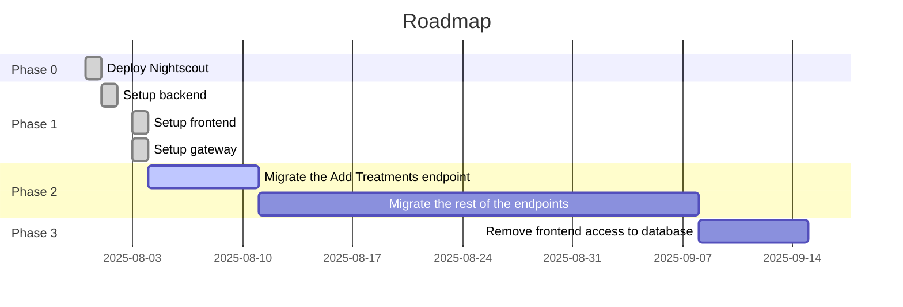
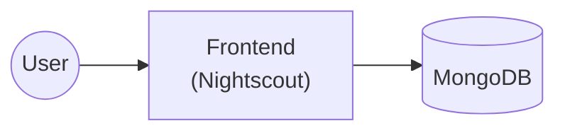
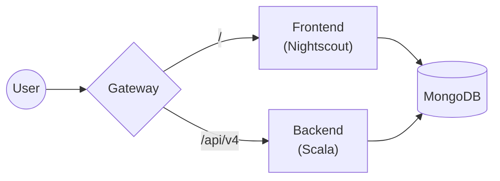
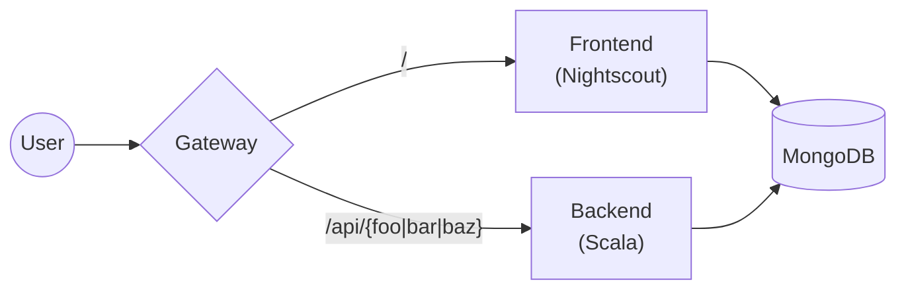
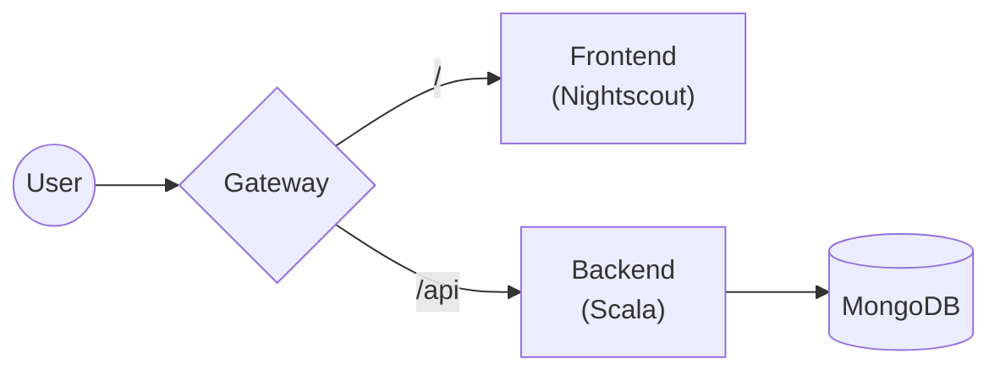

## Roadmap

### ~Phase 0~ (done)

This is our starting point.  Plain old Nightscout.

### Phase 1

Here, we add:

* A backend service with a wholly new API at `/api/v4/...`
    * Uses the existing authz roles for access control
* A gateway that:
    * Routes `/api/v4/*` to the backend
    * Routes everything else to the frontend

### Phase 2 (in progress)

Here, we incrementally move endpoints over from the frontend to the
backend.

### Phase 3 (next)

Once all the API endpoints have been moved to the backend, we remove the
frontend's access to the database.
